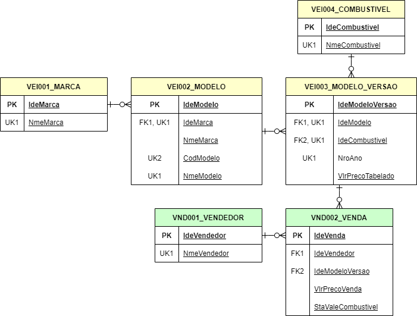

# GEAP

Desde 1945 cuidando da saúde dos servidores públicos federais ativos, aposentados e familiares, a Geap Autogestão em Saúde é uma das mais importantes operadoras de planos de saúde do Brasil. Em sua trajetória, a empresa tornou-se referência no mercado da saúde suplementar ao investir de forma pioneira num modelo assistencial focado na promoção da saúde, prevenção de doenças e na melhoria da qualidade de vida dos assistidos.

Sem fins lucrativos, a Geap reverte todos os seus recursos para a assistência integral dos seus mais de 340 mil beneficiários. É a operadora que agrega o maior número de idosos, com 52% da carteira de beneficiários composta por pessoas a partir de 60 anos. A Geap se orgulha de cuidar da saúde de 500 brasileiros que já passaram dos 100 anos, são guardiões da experiência histórica brasileira e precisam de uma atenção especial nesta fase da vida.

* **Missão**: Promover a assistência à saúde aos seus beneficiários por meio de uma gestão sustentável, ética, inovadora e transparente.

* **Visão**: Ser a melhor autogestão de saúde do país de forma sustentável.

* **Valores**:

    - COMPROMISSO COM A VIDA
    - CREDIBILIDADE NOS SERVIÇOS PRESTADOS
    - EXCELÊNCIA NO CUIDADO À SAÚDE
    - MARCA GEAP CONSOLIDADA
    - RESPONSABILIDADE COM AS PESSOAS
    - INOVAÇÃO NA GESTÃO
    - INTEGRIDADE NA GOVERNANÇA

✔ [Conheça mais sobre a Geap.](https://www.geap.com.br/)

# Avaliação prática para Analista de Tecnologia - Desenvolvedor

O teste prático para o processo seletivo para o cargo de Analista de Tecnologia - Desenvolvedor da Geap tem por objetivo avaliar a abordagem adotado pelo candidato na solução de problemas para atender aos requisitos de negócios durante o desenvolvimento de software.

Para executar a avaliação, você deve ler atentamente a história sobre o problema oferecido e desenvolver a solução que atenda aos requisitos propostos.

> Estamos torcendo por você!

## História

Uma concessionária de veículos pretende comissionar seus vendedores por todas as vendas realizadas. Para isso, solicitou ao seu setor de TI que desenvolvesse um aplicação para exibir um relatório com o valor acumulado a ser pago a cada um de seus vendedores.

As regras para cálculo do comissionamento são:
- Cada venda será comissionada.
- Cada vendedor é comissionado apenas por suas vendas.
- O valor da comissão é de 1% do valor da venda.
- Se na venda foi emitido um vale combustível para o veículo ao comprador, a comissão desta venda sofrerá um desconto de acordo com a tabela:

    |Combustível do veículo vendido|Desconto da comissão|
    |-|-|
    |Gasolina|R$ 200,00|
    |Álcool|R$ 180,00|
    |Diesel|R$ 150,00|

- Se o valor da comissão de uma venda for negativa, esta venda terá sua comissão igual a zero.

## Requisito

Crie em seu projeto uma tela que exibe uma tabela com o valor total a ser comissionado para cada vendedor. A tebela deve ter a seguinte estrutura:

|Nome do vendedor|Quantidade de veículos vendidos|Quantidade de vales combutíveis emitidos|Total em vendas|Total da comissão|
|-|-|-|-|-|
|Nome do vendedor 1|0.000|0.000|R$ 0.000|R$ 0.000|
|Nome do vendedor 2|0.000|0.000|R$ 0.000|R$ 0.000|
|-|-|-|-|-|
|**Total Geral**|**0.000**|**0.000**|**R$ 0.000**|**R$ 0.000**|

## Modelagem

Banco de dados SQL Server 2016. Você pode usar o SQL Server LocalDB em seu ambiente local.

## Como criar a estrutura de banco de dados

No diretório [SQL](SQL) contém todos os scripts necessários para a criação e população das estruturas de dados do banco de dados da concessionária.

**DICA**: No diretório [SQL/Queries](SQL/Queries) contém alguns scripts de consulta para auxiliar no entendimento da modelagem.

**ATENÇÃO**: Utilize apenas os dados populados pelo script [Data.sql](SQL/Data.sql) para obter o resultado esperado.

**ATENÇÃO**: Não crie nenhuma estrutura de dados além da disponibilizada nestes scripts.

**ATENÇÃO**: A lista de comissionamento deve ser obtida pela aplicação chamando a procedure [ListarComissoesVendedores](SQL/Procedures/ListarComissoesVendedores.sql). Altere o comportamento desta procedure para obter o resultado esperado. **O código desta procedure deve ser commitado no seu projeto.**

**ATENÇÃO**: O projeto deve compilar e executar para avaliarmos.

## Passo-a-passo

1. Executar os scripts de criação da estrutura do banco de dados na seguinte ordem:

    - [SQL/Database.sql](SQL/Database.sql)
    - [SQL/Tables/VEI001_MARCA.sql](SQL/Tables/VEI001_MARCA.sql)
    - [SQL/Tables/VEI002_MODELO.sql](SQL/Tables/VEI002_MODELO.sql)
    - [SQL/Tables/VEI003_COMBUSTIVEL.sql](SQL/Tables/VEI003_COMBUSTIVEL.sql)
    - [SQL/Tables/VEI004_MODELO_VERSAO.sql](SQL/Tables/VEI004_MODELO_VERSAO.sql)
    - [SQL/Tables/VND001_VENDEDOR.sql](SQL/Tables/VND001_VENDEDOR.sql)
    - [SQL/Tables/VND002_VENDA.sql](SQL/Tables/VND002_VENDA.sql)
    - [SQL/ForeignKeys.sql](SQL/ForeignKeys.sql)
    - [SQL/Data.sql](SQL/Data.sql)
    - [SQL/Procedures/ListarComissoesVendedores.sql](SQL/Procedures/ListarComissoesVendedores.sql)

    **ATENÇÃO**: Execute a consulta [SQL/Queries/ValorMedioDasVendas.sql](SQL/Queries/ValorMedioDasVendas.sql) para validar se a instalação do banco de dados está correta.

    O resultado da consulta deve estar conforme a tabela:
    |VlrTotalVendas|VlrTotalTabeladoVendas|PctMargemVendas|QtdVendas|VlrMedioVendas|
    |-|-|-|-|-|
    |214816853.00|214821686.00|-0.0023|5245|40956.50|

2. Criar um projeto **público** pessoal na plataforma GitHub ou GitLab.

3. Clonar o seu repositório pessoal em seu ambiente de desenvolvimento local.

4. Criar o projeto de software para desenvolvimento da solução.

    Você pode escolher uma das seguintes opções de projetos:

    - ASP.NET MVC 5 com linguagem C#
    - ASP.NET WebForms com linguagem VB.NET
    - Vue.js + WebAPI em ASP.NET Core (ou .NET 5)
    - Quasar Framework + WebAPI em ASP.NET Core (ou .NET 5)

5. Desenvolver a solução que atenda aos requisitos para o problema proposto.

6. Escrever o arquivo "README.md" do seu projeto com as instruções para executar a aplicação.

7. *Commitar* o código no seu repositório local.

8. Subir seu projeto para o seu repositório pessoal.

9. Nos fornecer a url para o seu repositório para avaliarmos.

---

### Teste obtido no ínicio de 2022. Feito em dotNet6 